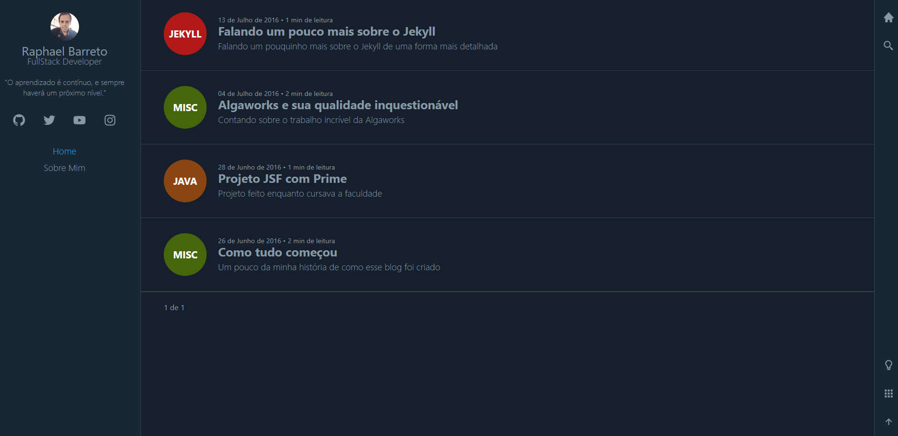

<h1 align="center">
  
</h1>

<h2 align="center">Meus contatos</h2>

  &nbsp;&nbsp;
  &nbsp;&nbsp;
  &nbsp;&nbsp;
  

## 👋 Olá à todos 👋,

Me chamo Raphael Barreto e sou Desenvolvedor Full Stack ➡ Focado nas tecnologias ReactJS, React Native e NodeJS 🚀

---

## 💪 Meu objetivo 💪

🙋‍♂️Eu ajudo empresas que querem usar a ⚡ Stack JavaScript | React | React Native ⚡ para construírem apps inovadores que tenham impacto na transformação na vida das pessoas. 🚀 

---
<h1 align="center">⬇ Projetos que desenvolvi ⬇</h1>
---

<h1 align="center">

<a href="https://github.com/raphabarreto/fastfeet" target="_blank">🚛 FastFeet 🚛</a>

</h1>

<h1 align="center">

<a href="https://github.com/raphabarreto/ecoleta" target="_blank">♻ Ecoleta ♻</a>

</h1>

<h1 align="center">

<a href="https://raphabarreto.com.br/" target="_blank">🌐 Meu site 🌐</a>

</h1>

